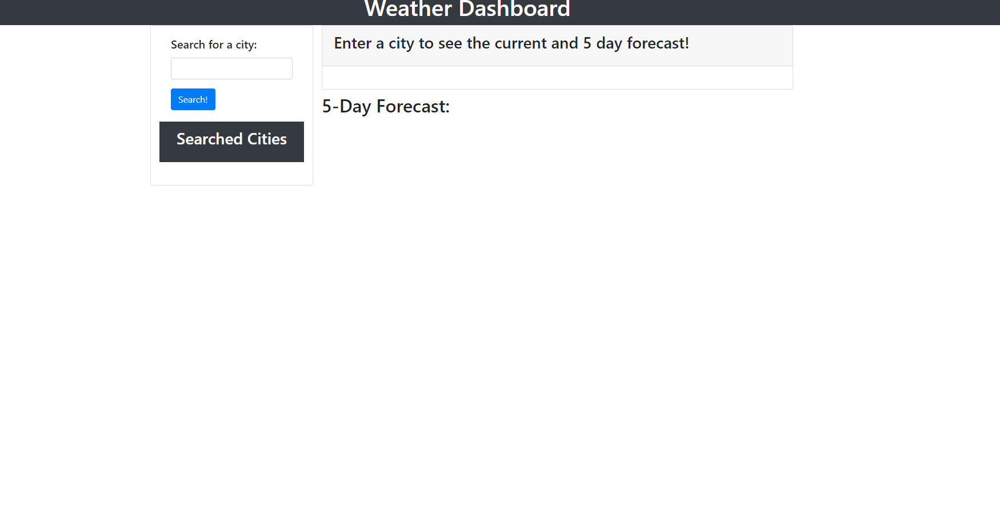
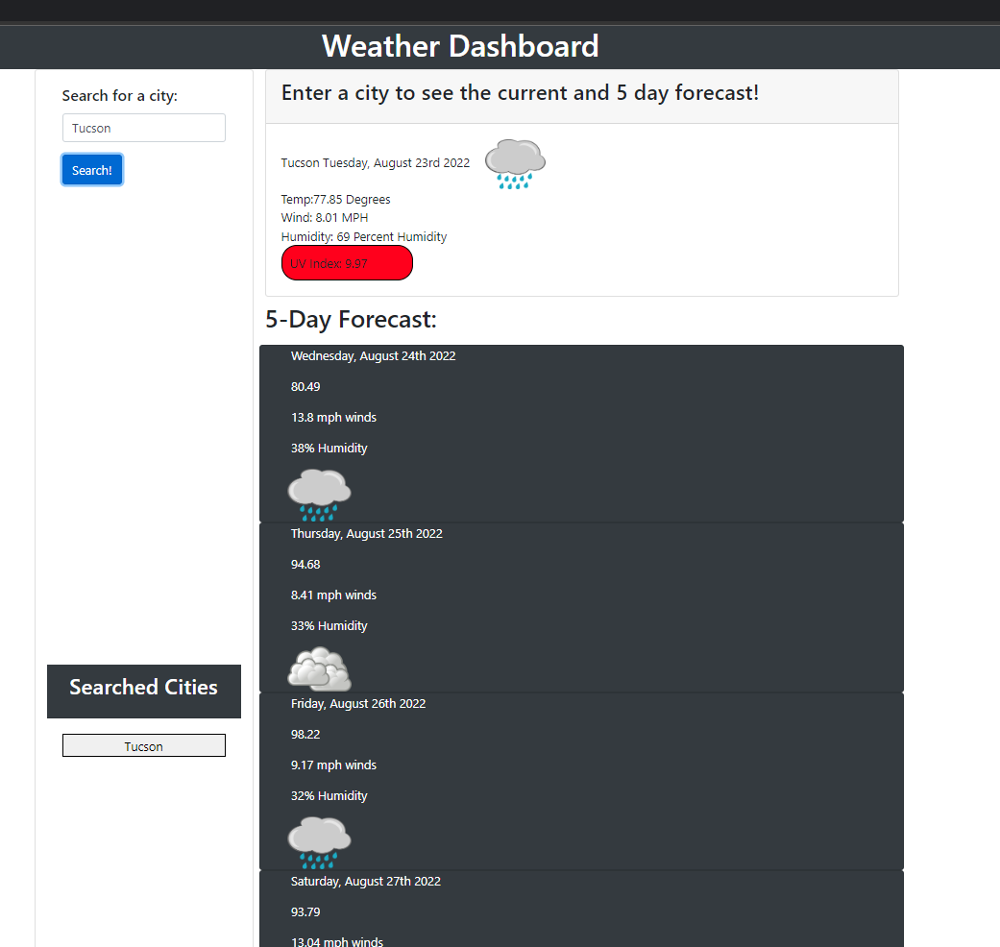

# Weather Dashboard
  
# Project Description:

  
  This application is licensed with <a href="undefined">MIT</a>. 
  

# Description  <h2 id="description"></h2>

    To be able to see the future forecast and be able to plan my trip accordingly. By putting the city in the search input you will get data from the weather API. Then displayed on the page will be the weather data that shows the current forecast and the 5 day future forecast. You will also be able to search past cities from previous searches.

   

# Table of Contents
  - <a href="#description">Description</a> 
  - <a href="#installation">Installation</a> 
  - <a href="#usage">Usage Instructions</a> 
  - <a href="#contribution">Constribution</a> 
  - <a href="#tests">Tests</a> 
  - <a href="#questions">Questions</a> 
  - <a href="#license">License Info</a> 

# Installation
  <h2 id="installation"></h2>

Vanilla JS, HTML, WeatherBoard API

   

# Usage
  <h2 id="usage"></h2>

Use the live application and search the city that you would like the current and 5 day forecast for.
   
    
# Links

My github link <a href="https://github.com/TreyMBach">TreyMBach</a>.  

 

# Contributions
  <h2 id="contribute"></h2>

None.

   

# Tests   
  <h2 id="tests"></h2>
   
Using the console log in the web application
   
   

# Questions

  If you have any questions contact me via:

  Email: treybachyt@gmail.com.  
  Github: <a href="https://github.com/TreyMBach">TreyMBach</a>.

  
  

